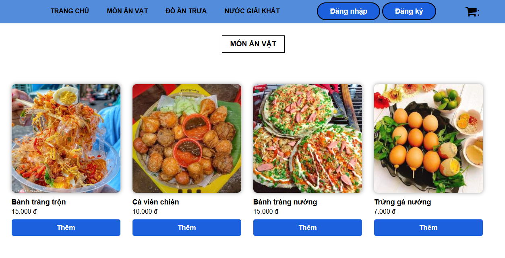
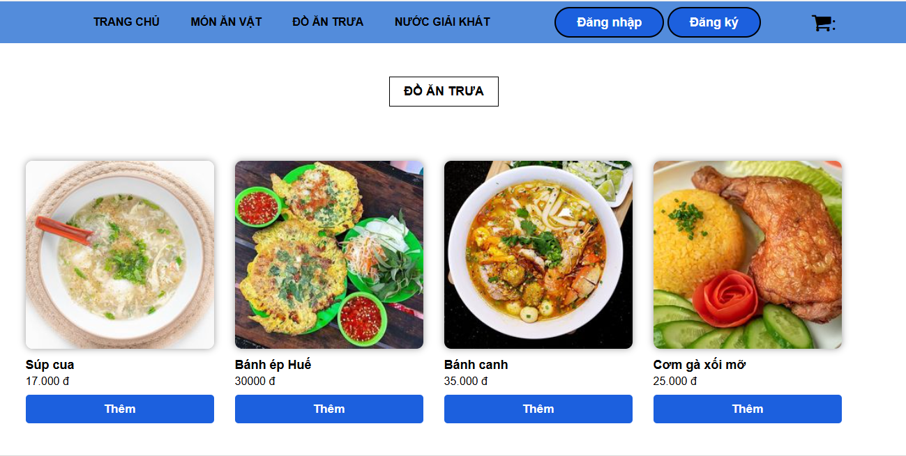
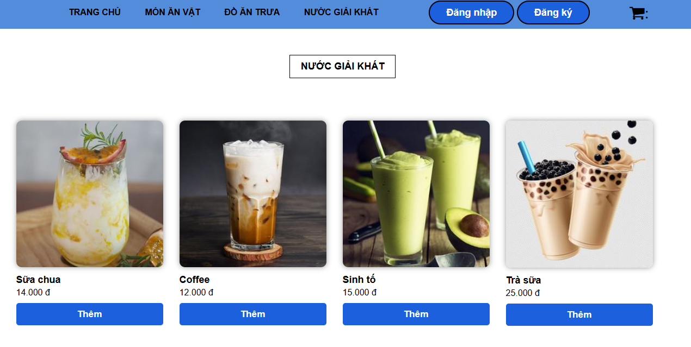
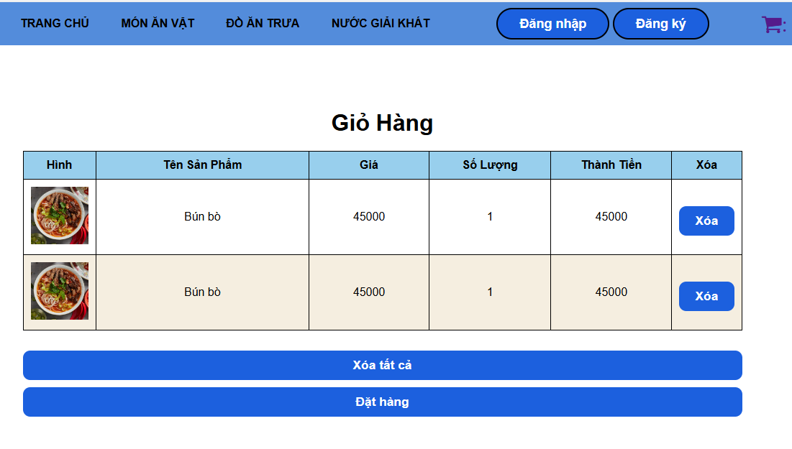

# OrderFood - Web Đặt Thức Ăn (Giao Diện)

## Giới thiệu
- OrderFood là một dự án giao diện người dùng cho trang web đặt thức ăn trực tuyến. 
- Web này là một trang web được thiết kế hướng tới việc dễ sử dụng và dễ dùng cho người tiêu dùng.
- Mục đích của web là cho phép người dùng có thể đặt đồ ăn  trực tuyến 

## Link demo: 
Xem bản demo của dự án tại đây: [OrderFood Demo](https://drive.google.com/file/d/16wQJu4eDyiTIfCeFUMwPdZAmxJS7dVnr/view?usp=sharing)

## Tính năng giao diện
- **Trang chủ**: Hiển thị danh sách các nhà hàng nổi bật và các món ăn phổ biến.

-

- **Trang Môn Ăn Vặt**: Hiển thị thực đơn với các món ăn vặt.

-

- **Trang Môn Ăn Trưa**: Hiển thị thực đơn với các món ăn trưa.

-

- **Trang Nước Giải Khát**: Hiển thị thực đơn với các đồ giải khát.

-

- **Giỏ hàng**: Cho phép người dùng chỉnh sửa các món ăn trong giỏ hàng.

-

## Công nghệ sử dụng

### FRONT END
- **HTML**: Cấu trúc nội dung trang web.
- **CSS**: Thiết kế giao diện người dùng, sử dụng các thư viện như Bootstrap để hỗ trợ bố cục đáp ứng.
- **JavaScript**: Tạo tương tác và xử lý các hành động của người dùng.

## Cấu trúc dự án
- `index.html`: Trang chủ của website.
- `monanvat.html`: Trang hiển thị thực đơn các món ăn vặt.
- `cart.html`: Trang giỏ hàng.
- `nuocgiaikhat.html`: Trang hiển thị thực đơn các đồ uống.
- `doantrua.html`: Trang hiển thị thực đơn các món ăn trưa.
- `dangky.html`: Trang đăng kí thông tin tài khoản.
- `dangnhap.html`: Trang đăng nhập thông tin tài khoản.
- `css/`: Thư mục chứa các file CSS để tùy chỉnh giao diện.
- `cart.js`: File JavaScript để tạo tương tác cho giao diện.

## Đóng góp
Nếu bạn có bất kỳ đề xuất hoặc cải tiến nào cho giao diện, vui lòng mở issue hoặc pull request để đóng góp cho dự án.
